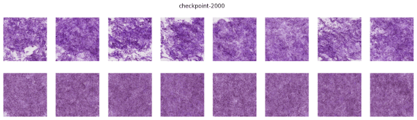
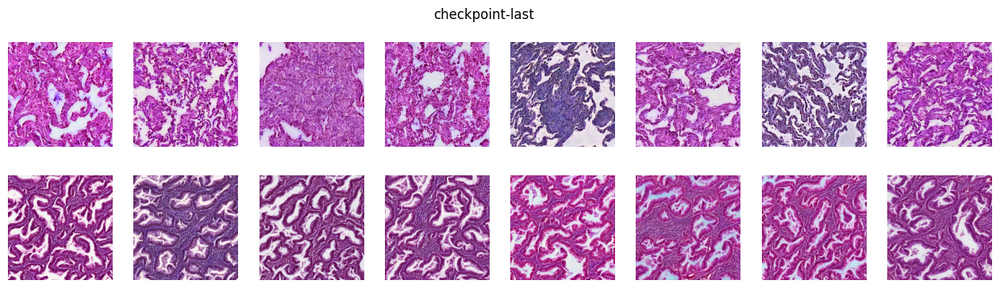
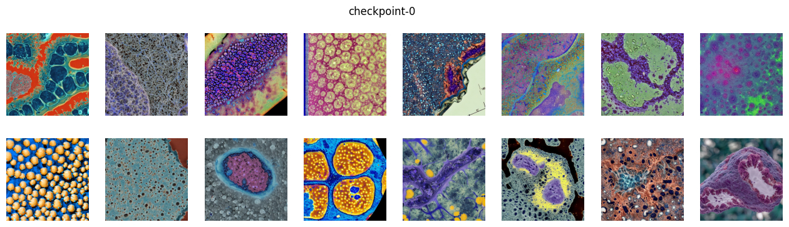

# LoRA TCGA-LUAD Generator
Make fake pathology images refered to lung adenocarcinoma WSI patch images (TCGA-LUAD).   
https://portal.gdc.cancer.gov/projects/TCGA-LUAD   
Base model is runwayml/stable-diffusion-v1-5   
https://huggingface.co/runwayml/stable-diffusion-v1-5   
   
## Data Prepared
Patch size is 500 microns and same interval size with resizing as 128 x 128 pixel. 
They have two type of captions that "H&E stain pathology image with lung adenocarcinoma" in positive patch images and "H&E stain pathology image with lung normal" in negative images. 
Example data in ./total directory.
   
## Training LoRA
Training code is a little modified guide training code    
https://github.com/huggingface/diffusers/blob/main/examples/text_to_image/train_text_to_image_lora.py   
Option was written in train.sh script
```bash
bash train.sh
```
   
   
## Generate Images
LoRA weight located in ./output/LUAD folder. 
Also checkpoint weight located in sub directory such as ./output/LUAD/checkpoint-10000.   
Image generator example code is   
```bash
python make_image.py
```
Fake iamge examples with normal and adenocarcinoma case.   
   
Without LoRA images are   
   
